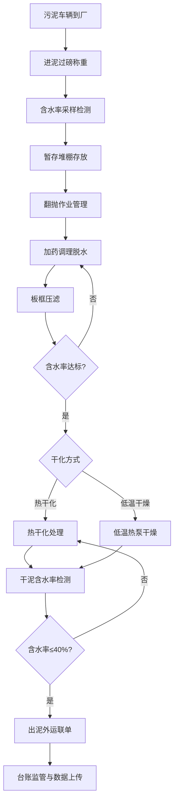

## 1. 产品概述

污泥处置中心市政污泥业务管理应用，面向环保运营公司，实现从污泥进厂称重、暂存调理、干化处置到出泥外运的全流程数字化管控，确保处置过程可追溯、数据可监管、台账可查询。

- 解决污泥处置全流程纸质化、数据分散、监管困难等问题
- 目标用户：污泥处置中心运营管理人员、环保监管人员、运输司机

## 2. 核心功能

### 2.1 用户角色

| 角色 | 注册方式 | 核心权限 |
|------|----------|----------|
| 运营管理员 | 企业微信授权 | 全部模块操作、数据查看、报表导出 |
| 过磅员 | 企业微信授权 | 进泥过磅、含水率检测录入 |
| 车间操作员 | 企业微信授权 | 调理脱水、热干化、低温干燥操作录入 |
| 监管人员 | 企业微信授权 | 台账查看、数据审核、统计报表 |

### 2.2 功能模块

1. **首页仪表盘**: 今日处置概览、各环节关键指标、快捷入口、异常告警
2. **进泥过磅**: 车辆过磅登记、含水率检测、进泥记录查询
3. **暂存堆棚**: 堆棚库存管理、翻抛作业记录、含水率跟踪
4. **调理脱水**: 加药调理方案、板框压滤记录、脱水效果监控
5. **热干化**: 干化温度监控、干污泥含水率检测、能耗统计
6. **低温干燥**: 热泵干燥参数、臭气除臭记录、干燥效果跟踪
7. **出泥外运**: 外运联单管理、车辆调度、外运记录查询
8. **台账监管**: 处置量统计、在线数据上传、合规报表生成

### 2.3 页面详情

| 页面名称 | 模块名称 | 功能描述 |
|----------|----------|----------|
| 首页仪表盘 | 今日概览 | 显示当日进泥量、处置量、出泥量、库存量等关键指标卡片 |
| 首页仪表盘 | 环节状态 | 七大环节进度条/状态指示，直观展示当前各环节运行状态 |
| 首页仪表盘 | 异常告警 | 含水率超标、温度异常等实时告警列表 |
| 首页仪表盘 | 快捷入口 | 七大模块快捷导航卡片 |
| 进泥过磅 | 过磅登记 | 录入车牌号、毛重、皮重、净重、来源单位、司机信息 |
| 进泥过磅 | 含水率检测 | 录入采样编号、检测方法、含水率数值、检测人、检测时间 |
| 进泥过磅 | 进泥记录 | 按日期/车牌/来源筛选查询历史进泥记录 |
| 暂存堆棚 | 库存管理 | 各堆棚当前库存量、堆放时间、含水率显示 |
| 暂存堆棚 | 翻抛记录 | 记录翻抛时间、翻抛区域、操作人、翻抛前后含水率 |
| 调理脱水 | 加药调理 | 记录加药种类、加药量、污泥量、配比方案、操作人 |
| 调理脱水 | 板框压滤 | 记录压滤批次、进料量、压滤时间、出泥含水率、滤液量 |
| 热干化 | 温度监控 | 实时温度显示（进风/出风/筒体），温度曲线图 |
| 热干化 | 含水率检测 | 干化后污泥含水率检测记录，对比干化前后含水率变化 |
| 低温干燥 | 热泵干燥 | 干燥温度、湿度、风量参数记录，批次干燥时长 |
| 低温干燥 | 臭气除臭 | 除臭设备运行记录、除臭剂用量、臭气浓度检测 |
| 出泥外运 | 联单管理 | 创建/查看外运联单：收泥单位、运输车辆、干泥量、联单编号 |
| 出泥外运 | 外运记录 | 按日期/联单号/收泥单位查询历史外运记录 |
| 台账监管 | 处置量统计 | 日/月/年处置量统计图表，各环节数据汇总 |
| 台账监管 | 数据上传 | 在线数据上传至监管平台，上传状态跟踪 |
| 台账监管 | 合规报表 | 生成合规报表，支持导出 |

## 3. 核心流程

污泥从进厂到出厂的全流程管控：

1. 运输车辆到达 → 过磅称重 → 含水率采样检测 → 入暂存堆棚
2. 堆棚暂存 → 定期翻抛 → 送至调理脱水车间
3. 加药调理 → 板框压滤脱水 → 含水率降至60%以下
4. 脱水污泥 → 热干化/低温干燥 → 含水率降至40%以下
5. 干污泥 → 外运联单 → 运输至终端处置单位
6. 全流程数据 → 台账记录 → 统计报表 → 在线上传监管平台

## 4. 用户界面设计

### 4.1 设计风格

- **主色调**: 深青色(#0F766E) + 暖琥珀色(#D97706)点缀，体现环保工业气质
- **辅助色**: 石板灰(#475569)作为中性色，翠绿(#10B981)表示正常状态，红色(#EF4444)表示告警
- **按钮风格**: 圆角(8px)，主要操作按钮填充色，次要操作描边样式
- **字体**: 标题使用思源黑体(Noto Sans SC)，正文使用系统默认中文字体
- **布局风格**: 左侧固定导航栏 + 右侧内容区，卡片式布局，表格数据展示
- **图标风格**: Lucide线性图标，统一2px描边

### 4.2 页面设计概述

| 页面名称 | 模块名称 | UI元素 |
|----------|----------|--------|
| 首页仪表盘 | 今日概览 | 4个数据卡片(进泥量/处置量/出泥量/库存)，数字大字号+单位标注，带趋势箭头 |
| 首页仪表盘 | 环节状态 | 7个横向进度条，颜色编码(绿/黄/红)，流程箭头连接 |
| 首页仪表盘 | 异常告警 | 红色边框告警卡片列表，显示告警类型/时间/级别 |
| 首页仪表盘 | 快捷入口 | 2×4网格卡片，每卡片含图标+模块名+今日数据摘要 |
| 进泥过磅 | 过磅登记 | 表单布局(2列)，数字输入框带单位，车牌号输入，日期时间选择器 |
| 进泥过磅 | 含水率检测 | 检测结果高亮显示，超标红色警示，检测记录表格 |
| 进泥过磅 | 进泥记录 | 筛选条件栏 + 数据表格 + 分页，支持导出 |
| 暂存堆棚 | 库存管理 | 堆棚卡片视图(3列)，显示容量进度条，含水率标签 |
| 暂存堆棚 | 翻抛记录 | 时间轴布局，翻抛前后含水率对比柱状图 |
| 调理脱水 | 加药调理 | 方案卡片 + 加药记录表，配比饼图 |
| 调理脱水 | 板框压滤 | 批次卡片列表，含水率变化折线图 |
| 热干化 | 温度监控 | 实时温度仪表盘，温度曲线图(24h)，温度区间色带 |
| 热干化 | 含水率检测 | 检测数据表格，干化前后对比图 |
| 低温干燥 | 热泵干燥 | 参数监控面板(温度/湿度/风量)，批次干燥曲线 |
| 低温干燥 | 臭气除臭 | 设备运行状态卡片，除臭效果趋势图 |
| 出泥外运 | 联单管理 | 联单表单(可打印预览)，联单状态标签(待审/已审/已发) |
| 出泥外运 | 外运记录 | 表格布局，联单号可点击查看详情 |
| 台账监管 | 处置量统计 | 柱状图+折线图混合，日期范围选择器 |
| 台账监管 | 数据上传 | 上传任务列表，状态标签(待传/已传/失败) |
| 台账监管 | 合规报表 | 报表预览区，导出按钮 |

### 4.3 响应式设计

- 桌面端优先设计(1280px+)
- 平板端适配(768px-1279px)：侧边栏折叠为图标模式
- 移动端适配(<768px)：底部Tab导航，卡片单列排列
- 企业微信内嵌浏览器适配

### 4.4 设计特色

- 工业仪表盘风格：关键数据采用仪表盘/大数字展示，体现工业监控感
- 流程可视化：顶部横向流程条，展示污泥从进厂到出厂的流转节点
- 状态色彩编码：统一使用绿/黄/红三色表示正常/预警/异常状态
- 数据驱动：图表使用Recharts，支持交互式数据探索
