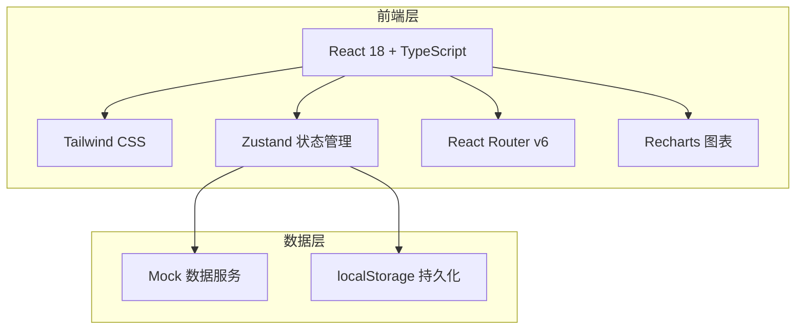

## 1. 架构设计

## 2. 技术说明

- **前端**: React@18 + TypeScript + Tailwind CSS@3 + Vite
- **初始化工具**: vite-init (react-ts 模板)
- **后端**: 无（纯前端项目，使用 Mock 数据）
- **数据库**: 无（使用 localStorage + Mock 数据模拟）
- **图表**: Recharts（数据可视化）
- **图标**: lucide-react
- **状态管理**: Zustand

## 3. 路由定义

| 路由 | 用途 |
|------|------|
| `/` | 首页仪表盘，展示今日概览、环节状态、异常告警 |
| `/weighing` | 进泥过磅，车辆过磅登记与含水率检测 |
| `/storage` | 暂存堆棚，库存管理与翻抛记录 |
| `/dewatering` | 调理脱水，加药调理与板框压滤 |
| `/thermal-drying` | 热干化，温度监控与含水率检测 |
| `/low-temp-drying` | 低温干燥，热泵干燥与臭气除臭 |
| `/transport` | 出泥外运，联单管理与外运记录 |
| `/ledger` | 台账监管，处置量统计与数据上传 |

## 4. 数据模型

### 4.1 数据模型定义

```mermaid
erDiagram
    "WeighingRecord" {
        string id PK
        string plateNumber
        number grossWeight
        number tareWeight
        number netWeight
        string sourceUnit
        string driver
        datetime weighTime
        string operator
    }
    
    "MoistureTest" {
        string id PK
        string sampleId
        string weighingId FK
        number moistureRate
        string testMethod
        string tester
        datetime testTime
        boolean isQualified
    }
    
    "StorageShed" {
        string id PK
        string name
        number capacity
        number currentStock
        number moistureRate
        datetime lastTurnTime
        string status
    }
    
    "TurnRecord" {
        string id PK
        string shedId FK
        datetime turnTime
        string area
        string operator
        number beforeMoisture
        number afterMoisture
    }
    
    "ConditioningRecord" {
        string id PK
        string batchNo
        number sludgeAmount
        string chemicalType
        number chemicalDosage
        string ratio
        string operator
        datetime operateTime
    }
    
    "FilterPressRecord" {
        string id PK
        string batchNo
        number feedAmount
        number pressTime
        number outputMoisture
        number filtrateVolume
        string operator
        datetime operateTime
    }
    
    "ThermalDryingRecord" {
        string id PK
        string batchNo
        number inletTemp
        number outletTemp
        number drumTemp
        number outputMoisture
        number energyConsumption
        string operator
        datetime operateTime
    }
    
    "LowTempDryingRecord" {
        string id PK
        string batchNo
        number dryTemp
        number humidity
        number airVolume
        number duration
        number outputMoisture
        string operator
        datetime operateTime
    }
    
    "DeodorizationRecord" {
        string id PK
        string batchNo
        string equipmentStatus
        number deodorantDosage
        number odorConcentration
        string operator
        datetime operateTime
    }
    
    "TransportManifest" {
        string id PK
        string manifestNo
        string receivingUnit
        string plateNumber
        number drySludgeWeight
        string status
        string operator
        datetime createTime
    }
    
    "DailyStatistics" {
        string id PK
        date date
        number intakeAmount
        number processedAmount
        number outputAmount
        number stockAmount
        number avgMoisture
    }

    "WeighingRecord" ||--o{ "MoistureTest" : "has"
    "StorageShed" ||--o{ "TurnRecord" : "has"
```

### 4.2 数据定义

本项目使用 Mock 数据 + localStorage 持久化，数据结构通过 TypeScript 接口定义，存储在 Zustand store 中。首次加载时生成模拟数据，后续操作实时更新至 localStorage。
